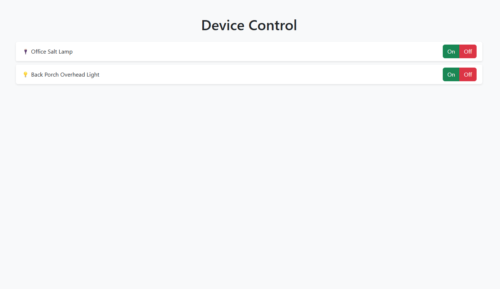

# Google Home Suite / Smart Home Control from Web UI

A Node.js based application for managing Kasa TP-Link smart devices (plugs and bulbs) through a responsive web interface. This project allows you to control, schedule, and monitor your smart home devices from any device with a web browser.

This will be running on a raspberry pi.

Inspiration:

Network Chuck
https://www.youtube.com/watch?v=k02P5nghmfs 

